## 1. Налаштування акаунту

### a. Створення адміністративного користувача IAM

Було створено користувача IAM з іменем `admin-user`. Для надання повних адміністративних прав, цьому користувачу було безпосередньо приєднано керовану політику AWS `AdministratorAccess`. Цей процес зображено на рис. 1 та рис. 2.

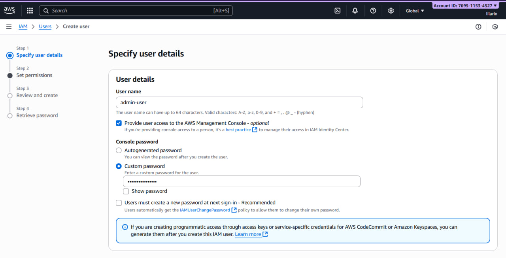
*Рис. 1 - Створення користувача admin-user*

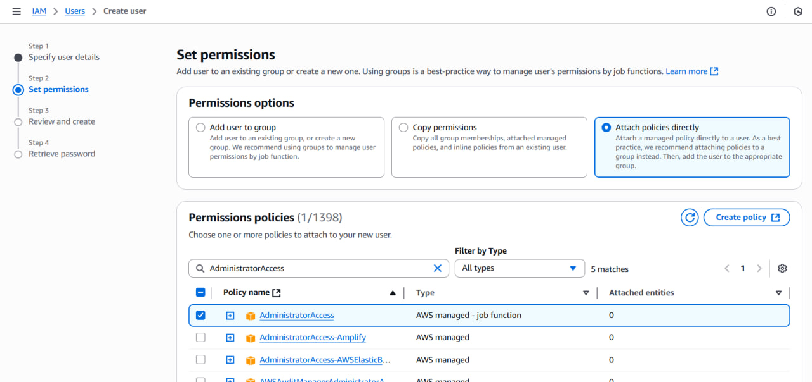
*Рис. 2 - Надання прав AdministratorAccess*

### b. Створення користувача в IAM Identity Center

Було увімкнено та налаштовано IAM Identity Center, що автоматично створило AWS Організацію (зображено на рис. 3). В Identity Center було створено нового користувача `sso-admin` (зображено на рис. 4).

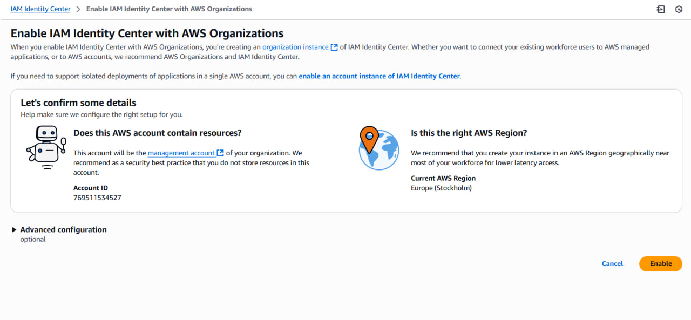
*Рис. 3 - Активація IAM Identity Center*

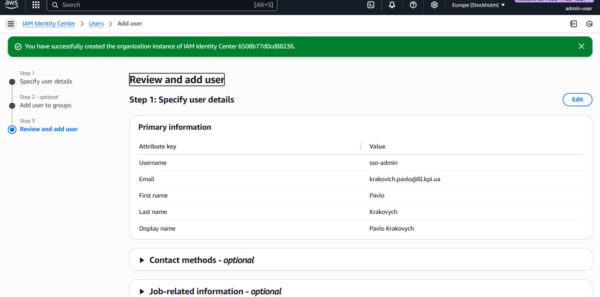
*Рис. 4 - Створення користувача sso-admin*

Для цього користувача було створено набір дозволів (Permission Set) `AdministratorAccess` та `ReadOnlyAccess` на основі існуючих політик AWS (зображено на рис. 5 та рис. 6). Після цього користувачу `sso-admin` було надано доступ до акаунту з правами адміністратора (зображено на рис. 7-10).

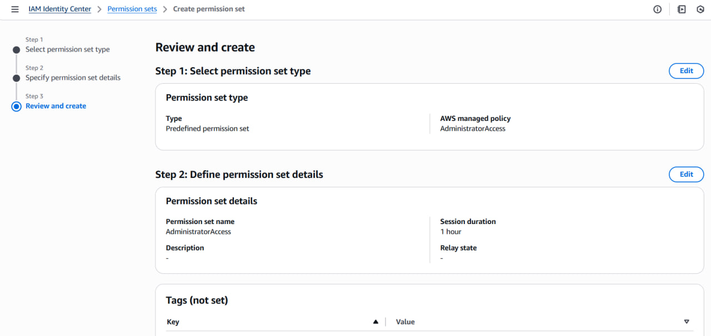
*Рис. 5 - Створення набору дозволів AdministratorAccess*

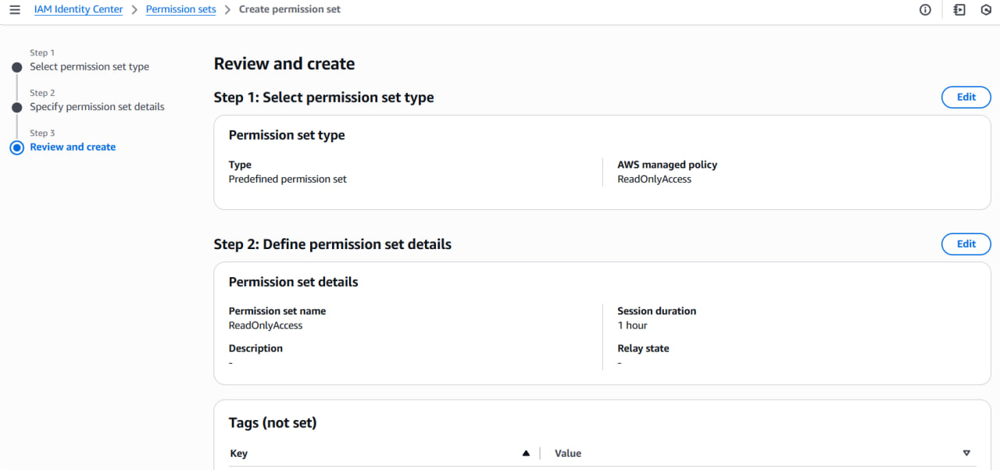
*Рис. 6 - Створення набору дозволів ReadOnlyAccess*

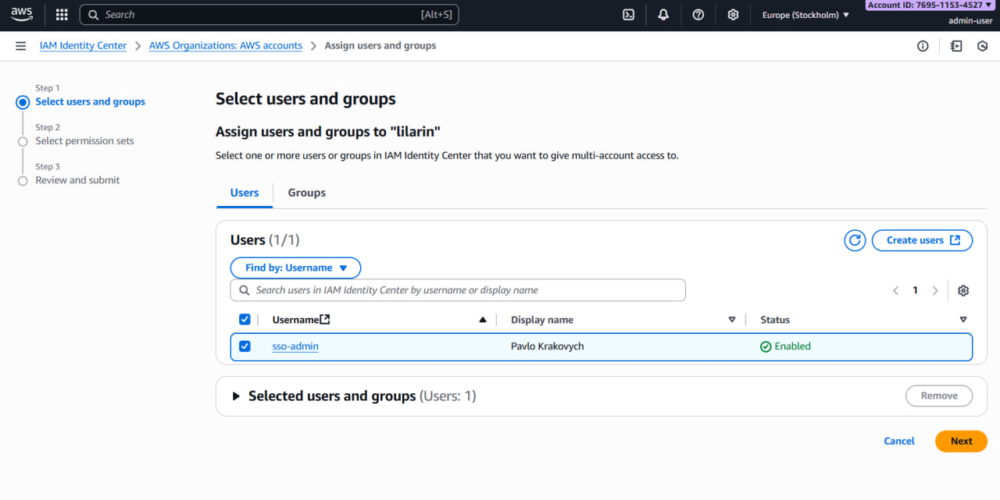*Рис. 7 - Вибір користувача для надання доступу*

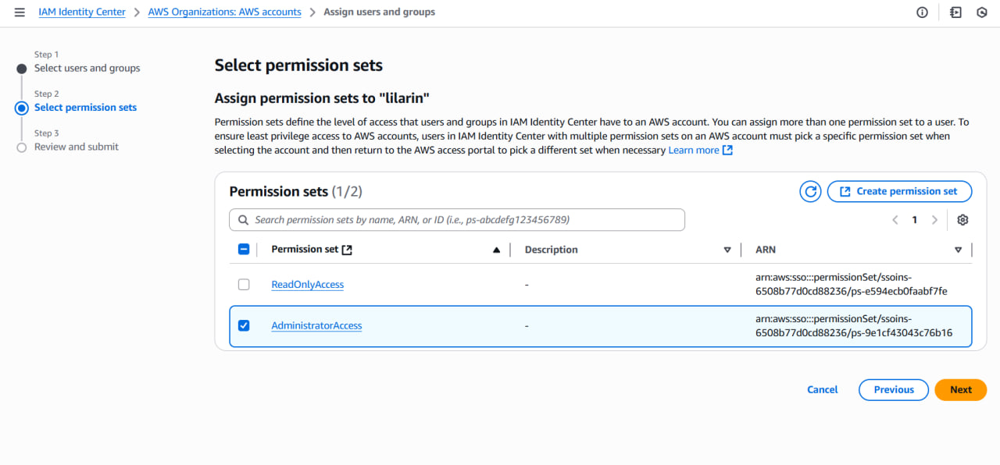*Рис. 8 - Вибір набору дозволів*

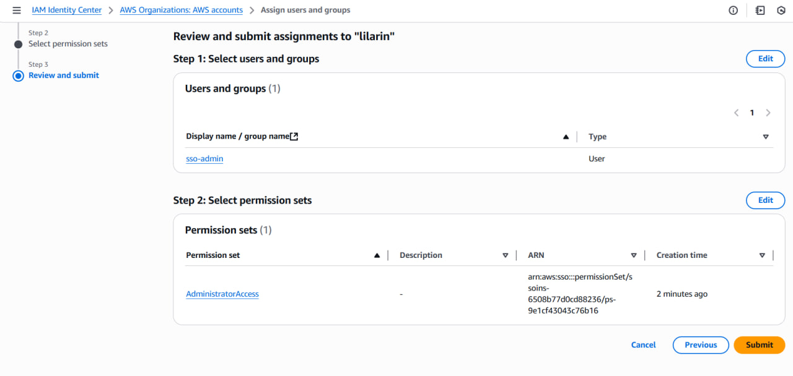
*Рис. 9 - Перегляд налаштувань доступу*

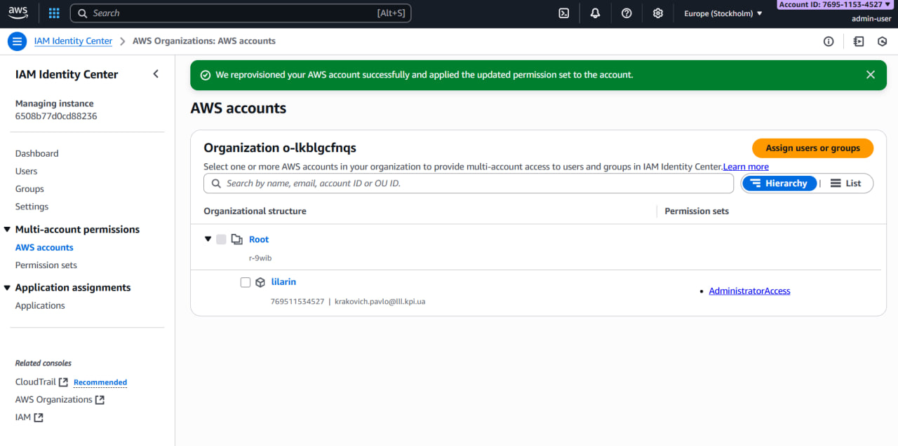
*Рис. 10 - Успішне надання доступу користувачу*

## 2. Створення Організації

Як зазначено вище, AWS Організація була створена автоматично під час активації IAM Identity Center (зображено на рис. 10).

## 3. Створення користувача з правами на читання

Було створено нового користувача IAM `readonly-user` (зображено на рис. 11). Йому було надано права виключно на перегляд ресурсів шляхом приєднання керованої політики `ViewOnlyAccess` (зображено на рис. 12).

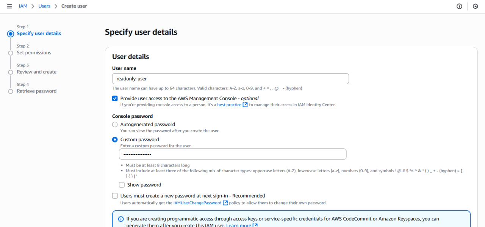
*Рис. 11 - Створення користувача readonly-user*

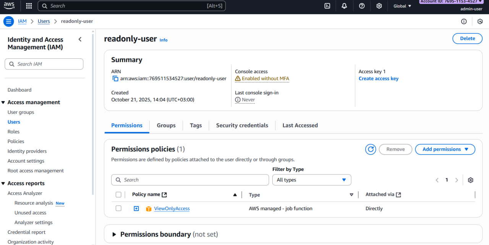
*Рис. 12 - Перевірка дозволів для readonly-user*

## 4. Створення IAM Ролі

Було створено IAM роль з назвою `ReadOnlyRole` (зображено на рис. 13). Користувачу `readonly-user` було надано дозвіл на "прийняття" цієї ролі (`sts:AssumeRole`) за допомогою вбудованої (inline) політики `AssumeReadOnlyRolePolicy` (зображено на рис. 14 та рис. 15).

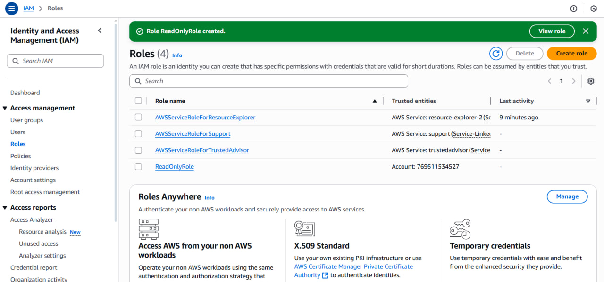
*Рис. 13 - Створена роль ReadOnlyRole у списку ролей*

*Рис. 14 - Політики, приєднані до readonly-user*

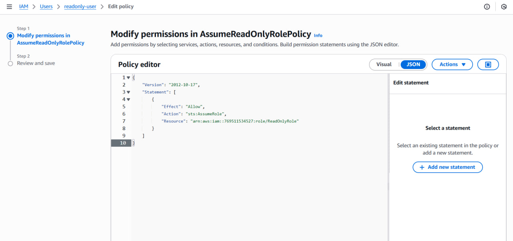
*Рис. 15 - JSON політики, що дозволяє AssumeRole*

## 5. Створення шаблону CloudFormation/IaC

Лістинг коду зображено у пунктах 1-6 файлу `main.tf`

## 6. Створення мережі (VPC)

Було створено віртуальну приватну мережу (VPC) `lab-project-vpc`. Мережа містить одну публічну підмережу (`lab-project-subnet-public1`) та одну приватну (`lab-project-subnet-private1`). Для доступу до інтернету з публічної підмережі було створено та приєднано Internet Gateway. Процес налаштування зображено на рис. 16, а результат — на рис. 17 та рис. 18.

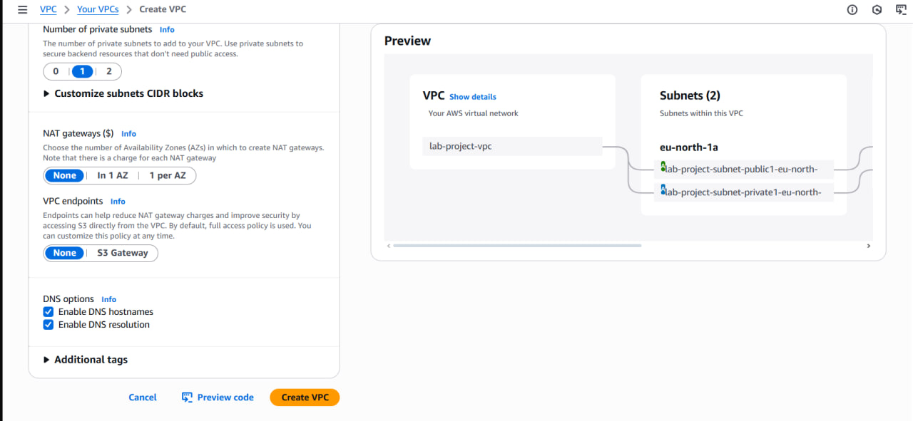
*Рис. 16 - Конфігурація нової VPC*

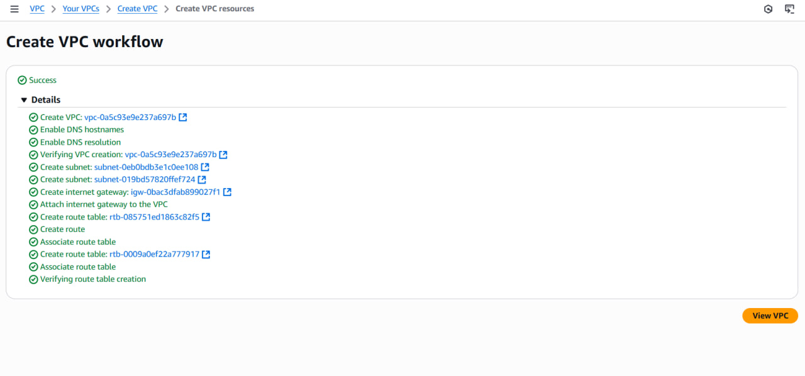
*Рис. 17 - Успішне створення ресурсів VPC*

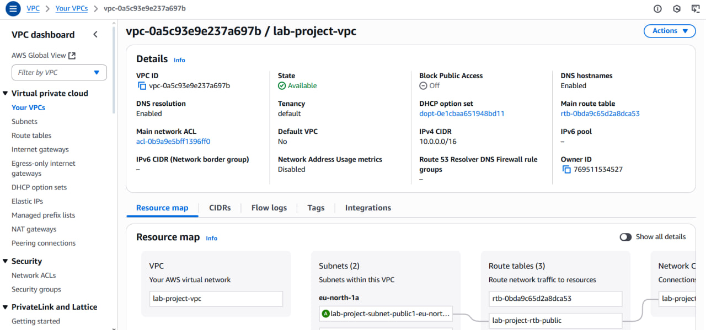
*Рис. 18 - Панель управління створеної VPC*

## 7. Створення IaC для мережі

Лістинг коду зображено у пунктах 7-11 файлу `main.tf`

## 8. Розрахунок місячного бюджету

Було проведено розрахунок орієнтовної місячної вартості для інфраструктури, що складатиметься з двох "шардів" та бази даних. Розрахунок проводився в [AWS Pricing Calculator](https://calculator.aws/#/estimate).

*   **Обчислювальні ресурси:** 2 інстанси Amazon EC2 типу `t4g.nano` (зображено на рис. 19).
*   **База даних:** 1 інстанс Amazon RDS для PostgreSQL з 20 GB сховища (зображено на рис. 20).

Загальна орієнтовна вартість на місяць становить **38.82 USD**, що відображено у підсумковому звіті калькулятора (зображено на рис. 21).

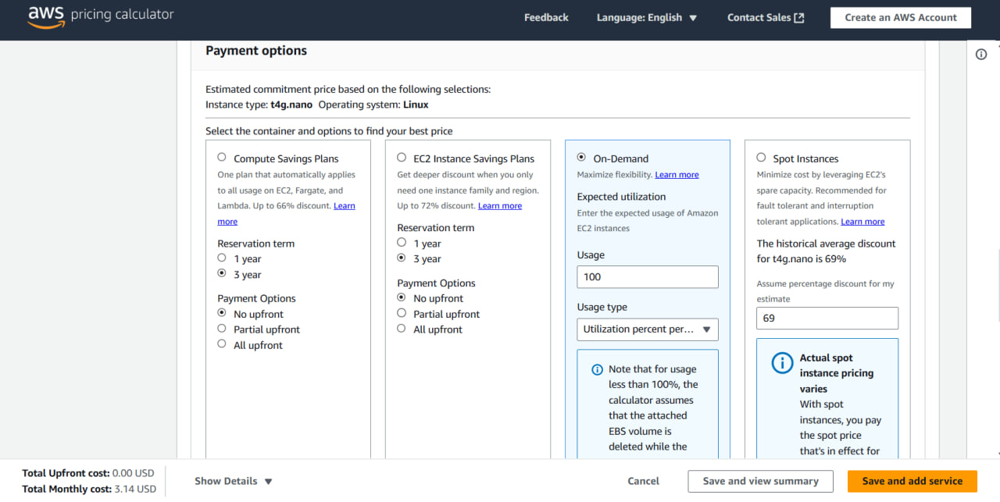
*Рис. 19 - Розрахунок вартості для одного інстансу EC2*

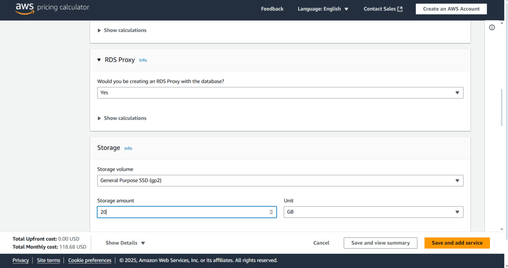
*Рис. 20 - Розрахунок вартості для RDS*

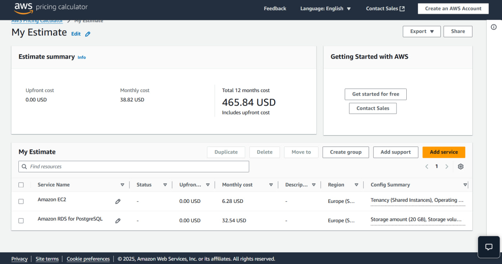
*Рис. 21 - Підсумкова місячна вартість*